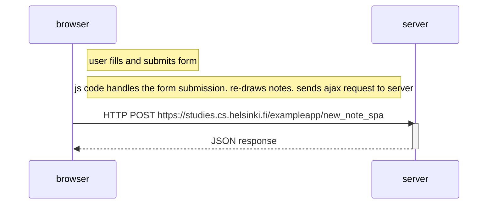

```mermaid
sequenceDiagram
    participant browser
    participant server

  Note right of browser: user fills and submits form
  Note right of browser: js code handles the form submission. re-draws notes. sends ajax request to server

  browser ->> server: HTTP POST https://studies.cs.helsinki.fi/exampleapp/new_note_spa
  activate server


  server -->> browser: JSON response
  deactivate server

```
